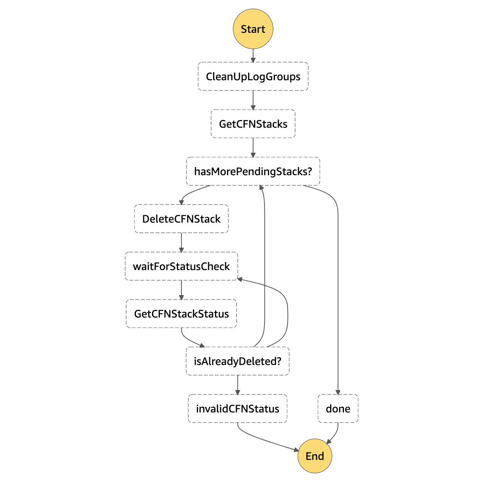

# Auto remove CDK dev environment


This is a small serverless application project that can be easy used to automatically remove the CDK produced CloudFormation stacks and CloudWatch log groups in a development account or environment, just to avoid forgotten provisioned resources out of working hours.

## Description

The deployed application will be executed in a scheduled basis (e.g. once per day during working days) and it **will remove first all CloudWatch log groups** according to the specified log groups prefix and later **will remove all CloudFormation stacks** with another specified prefix.

The removal of CloudWatch log groups it's almost instantaneous, but in the case of the CloudFormation stacks, this can take a lot of time depending on the resources provisioned by each stack and the number of stacks to be removed.

As this is a serverless approach to solve this problem with a Lambda functions computed basis, it's necessary to create a state machine that preserves state of the process while the lambda functions are invoked, destroyed and invoked again as many times as necessary.

The state machine produced will have a workflow like the following diagram:



Each capitalized name box it's the representation of a `task`, thus a Lambda function the performs something, while lowerCamelCase ones are flow connectors.

The `CleanUpLogGroups` task produce a list of all CloudWatch log groups with a match on the prefix provided by the `log-group-prefix` parameter and at the end, will remove all of them.

The `GetCFNStacks` task will produce a list of call CloudFormation stacks with a match on the prefix provided by the `stack-prefix` parameter. Then a loop will be started to process each element of the stacks list.

Inside the loop, the first thing to do is to delete the stack. Then it will wait for a while (60 seconds by default) and retrieve stack status. If the status is `DELETE_IN_PROGRESS`, the will wait again and retrieve status again after the wait action. If the status is `DELETE_COMPLETE`, it will go to the next stack, in any case else, the state machine will fail.

### Retaining stacks

Sometimes, maybe we don't want to delete certain stacks because they have external dependencies that must be managed manually or maybe the resources provisioned by the stack contains data that we want to preserve between development sessions.

For this purpose, a new feature since [v1.1.0](https://github.com/neovasili/cleanup-cdk-dev-env/releases/tag/v1.1.0) let the developer define stack tags to avoid it's automatic deletion.

To do this, add the following tag to those stacks that you want to retain:

|Tag Key|Tag Value|
|:--:|:--:|
|`RetentionPolicy`|`RETAIN`|

The tool will remove from the stacks deletion list all the stacks containing this tag.

## Requirements

* [Nodejs](https://nodejs.org/en/)
* [Python3](https://www.python.org/download/releases/3.0/)

## Development

For use this project in your local machine, just install npm dependencies:

```bash
npm install
```

To manually create a virtualenv on MacOS and Linux:

```bash
python3 -m venv .env
```

After the init process completes and the virtualenv is created, you can use the following
step to activate your virtualenv.

```bash
source .env/bin/activate
```

Once the virtualenv is activated, you can install the required dependencies.

```bash
pip3 install -r requirements.txt
```

### Pre-commit

A pre-commit configuration file is provided in this repo to perform some linterns, validations and so on in order to avoid commit code to the repo that later will fail in validations step in the build pipeline.

The first execution can be slower because of installation of dependencies. Further executions will use the pre-commit cache.

#### Pre-commit requirements

In order to use pre-commit with all the hooks declared you need to install the following:

* [Pre-commit](https://pre-commit.com/#install)
* [Markdownlint](https://github.com/markdownlint/markdownlint) (also requires ruby)
* [Shellcheck](https://github.com/koalaman/shellcheck)
* [pylint](https://www.pylint.org/#install)

#### Use pre-commit

Once you have all the requirements achieved, you have to install pre-commit in the local repository:

```bash
pre-commit install
```

And you can test it's working with the following:

```bash
➜ pre-commit run --all-files

Check for added large files..............................................Passed
Check for case conflicts.................................................Passed
Check that executables have shebangs.................(no files to check)Skipped
Check JSON...............................................................Passed
Check for merge conflicts................................................Passed
Trim Trailing Whitespace.................................................Passed
Detect AWS Credentials...................................................Passed
Tabs remover.............................................................Passed
Check markdown files.....................................................Passed
Test shell scripts with shellcheck...................(no files to check)Skipped
Yaml lintern.............................................................Passed
Python lintern...........................................................Passed
Python unit tests........................................................Passed
```

### Operation

This service has the following mandatory cli parameters:

|Parameter|Description|
|:--:|:--:|
|`stage`|Serverless application stage|
|`region`|AWS region to be deployed to|
|`name`|Name prefix for the service and all its components|
|`stack-prefix`|Prefix of the stacks to search for delete. Case sensitive|
|`log-group-prefix`|Prefix of the log groups to search for delete. Case sensitive|

Other relevant optional configuration parameters in the serverless yaml:

|Parameter|Default value|Description|
|:--:|:--:|:--:|
|`cfn_status_wait_time_in_seconds`|60|Time to wait for retrieve CloudFromation stack status retry in seconds|
|`schedule_trigger_cron_expression`|0 19 ? * MON-FRI *|Schedule cron expression to execute the application|

Here is an example of the deploy command:

```bash
sls deploy --stage dev --region eu-west-1 --name neovasili --stack-prefix neovasili --log-group-prefix neovasili
```
